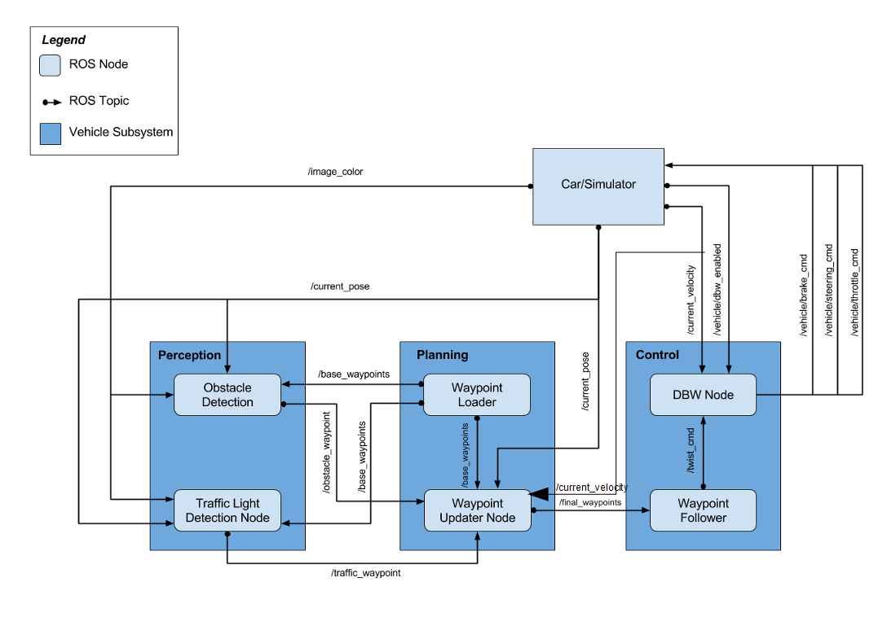

### This is Gabe Johnson's completed Capstone project for Udacity's Self-Driving Car Nanodegree

The original assignment repo can be found [here.](https://github.com/udacity/CarND-Capstone)


## Goal:
The goal of this project was to implement a ROS (Robot Operating System) framework to combine the various perception, planning, and control functions of a self-driving vehicle.  The project is run with a simulator which mimics an actual self-driving vehicle.  The simulator provides feedback from the vehicle's sensing systems including dashcam-style images, and it responds to commands for steering, braking, and accelerating.  Unfortunately, the use of Udacity's actual Lincoln MKZ self-driving vehicle has been suspended and was not available to run my code on.


## Implementation:
The picture below illustrates the relationships between the various ROS nodes:


The structure of the project was provided by Udacity and I was responsible for writing code to make the car steer around the track while following a provided set of waypoint coordinates, as well as appropriately stop and start at traffic lights along the way.
 
The project provides the simulator with a set of points directly ahead of the vehicle with associated steering, braking, and accelerating commands for each.  When you run the simulator, you will see a line of points in front of the vehicle that are highlighted in green.  These are the future points that the simulator is being told to traverse by executing the steering/braking/accelerating commands assigned to each point.  These points are dynamically updated to provide a steady stream of future instructions as the vehicle drives around the track.

The steering commands are calculated using a PID control loop which takes feedback from the simulator to adjust the steering in the desired future trajectory.

The braking and accelerating commands are determined by the need to stop or start at traffic lights.  They are calculated to provide smooth acceleration and deceleration including making the vehicle stop at the correct locations.

In the simulator, there are two ways to detect the traffic light color.  The simulator publishes to a vehicle/traffic_lights topic (not shown in the image above) which gives the coordinates and current colors of the traffic lights.  This was useful as a stepping stone.  The other way to detect trafffic light color is to use computer vision to classify images from the vehicle's dashcam based on traffic light status.  To do this, I used the TensorFlow API to train images in the SSD Inception V2 model.  I created two graphs - one trained on images from the simulator, and the other trained on pre-recorded images from Udacity's actual self-driving vehicle.  Each was trained for 10,000 steps.  In the next section I will explain how to run the code for these different scenarios.

To complete this project, the files I edited are:
- waypoint_updater.py
- tl_detector.py
- tl_classifier.py
- twist_controller.py
- dbw_node.py

The frozen graphs for the image classification are located in `ros/src/tl_detector/light_classification/SimModel` and `/RealImaggesModel`

This video shows the image classification results on the left:


## Options:
To choose between running the project by classifying images, or by using the traffic light location/color provided by the simultor, edit the `CLASSIFY_IMAGES` variable in tl\\_detector.py to either True or False.  Classifying the images will put quite a load on your computer, so the image classifier actually only classifies 1 out of 4 images to reduce lagging.  Another necessity for preventing the vehicle from out-running the simulator is to slow down the speed.  In twist\\_controller.py you will need to edit this speed by choosing a value for the `mx` value.  I have provided some options that worked for me - just uncomment the one you want to use or choose your own value based on your computer's capabilities.

To run the project without the simulator and instead use a rosbag of pre-recorded real-life images, change the `RUNNING_SIMULATOR` variable to False in the tl\\_classifier.py file and follow the instructions below in the Real Worls Testing section.


## Setup:

### Docker Installation
1. [Install Docker](https://docs.docker.com/engine/installation/)

2. Clone this repository

3. Build the docker container
```bash
docker build . -t capstone
```

4. Run the docker file
```bash
docker run -p 4567:4567 -v $PWD:/capstone -v /tmp/log:/root/.ros/ --rm -it capstone
```

### uWebSocketIO setup
Go to the uWebSocketIO directory in this repo and install via one of the .sh files.

### Simulator
Download the simulator [here.](https://github.com/udacity/CarND-Capstone/releases)

### Usage
1. Install python dependencies (note: this requirements.txt file has been changed from the original Udacity repo)
```bash
cd CarND-Capstone
pip install -r requirements.txt
```
2. Make and run styx
```bash
cd ros
catkin_make
source devel/setup.sh
roslaunch launch/styx.launch
```
3. Run the simulator.  Running with low resolution is recommended to prevent lagging.  Select the Highway option (the Test Lot is just a path with no lights or dashcam images).  When it starts, select Camera mode then unselect Manual mode.

### Real world testing
1. Download [training bag](https://s3-us-west-1.amazonaws.com/udacity-selfdrivingcar/traffic_light_bag_file.zip) that was recorded on the Udacity self-driving car.
2. Unzip the file
```bash
unzip traffic_light_bag_file.zip
```
3. Play the bag file
```bash
rosbag play -l traffic_light_bag_file/traffic_light_training.bag
```
4. Launch your project in site mode
```bash
cd CarND-Capstone/ros
roslaunch launch/site.launch
```

## Acknowledgements

I'd like to thank Alex Lechner @alex-lechner for his tips on using the TensorFlow API for training.  He put together a great guide [here.](https://github.com/alex-lechner/Traffic-Light-Classification#23-create-a-tfrecord-file)  I trained using the image datasets that he collected and labeled.  
I also used image datasets that were collected and labeled by Vatsal Srivastava @vatsl which can be found [here.](https://github.com/vatsl/TrafficLight_Detection-TensorFlowAPI#get-the-dataset)
